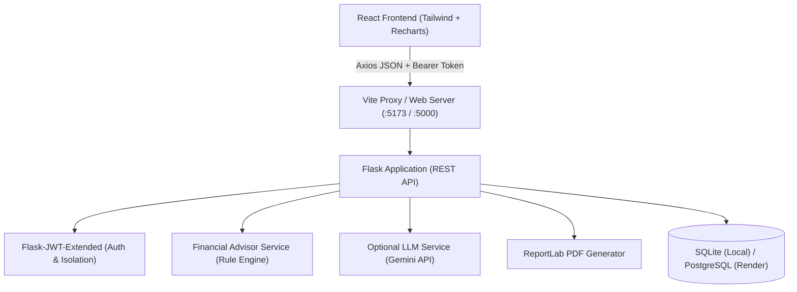

# Personal Finance Advisor Bot 💰🤖

An AI-powered full-stack personal finance and budgeting platform built for internship demonstration and real-world cash flow management.

The application allows users to securely track income and daily expenses, configure category budgets, set milestones for savings goals, evaluate financial health via transparent scoring metrics, and receive actionable AI recommendations.

---

## Table of Contents

- [Overview](#overview)
- [Key Features](#key-features)
- [Technology Stack](#technology-stack)
- [System Architecture](#system-architecture)
- [Project Structure](#project-structure)
- [Database Schema](#database-schema)
- [Database Configuration (SQLite & PostgreSQL)](#database-configuration)
- [API Documentation](#api-documentation)
- [Local Development Setup](#local-development-setup)
- [Production Deployment on Render](#production-deployment-on-render)
  - [Method 1: Render Blueprint (1-Click Automated)](#method-1-render-blueprint-recommended)
  - [Method 2: Manual Web Service Setup](#method-2-manual-web-service-setup)
- [Environment Variables](#environment-variables)
- [Automated Testing](#automated-testing)
- [Demo Credentials](#demo-credentials)
- [Future Enhancements](#future-enhancements)
- [Disclaimer](#disclaimer)

---

## Overview

Managing personal finances often involves manual spreadsheets, delayed budgeting feedback, and a lack of actionable advice. **Personal Finance Advisor Bot** solves this by providing:

1. **Deterministic Rule Engine (Fallback)**: Instant calculations of cash flow deficits, budget overruns, savings rates, and unbudgeted major expenditures without requiring external API keys.
2. **Optional LLM Integration**: Connects to modern Large Language Models (e.g. Gemini 1.5) via environment variables to produce natural-language financial narratives.
3. **Budget Health Score**: A transparent 0–100 indicator (Savings Rate, Budget Adherence, Expense-to-Income Ratio, and Savings Goal Progress) rather than an opaque proprietary credit score.
4. **Official PDF Statements**: Generates formatted, printable monthly statements on demand via the backend.
5. **Unified Full-Stack Architecture**: The Flask backend serves both the REST APIs (`/api/*`) and the compiled React single-page application (`frontend/dist`), eliminating cross-origin complications in production.

---

## Key Features

- **Secure Authentication**: JWT token authentication with PBKDF2 password hashing and strict multi-tenant data isolation.
- **Income Tracking**: Log salaries, freelancing, and side incomes with dates, sources, and descriptions.
- **Expense Management**: Log, search, filter, and sort expenses across 11 standard categories and 5 payment methods (Cash, UPI, Card, Net Banking, Other).
- **Monthly Budgets**: Set spending ceilings per category, monitor live consumption percentages, and receive visual alerts at 80% and 100%+ thresholds.
- **Savings Goals**: Track milestones (e.g. Emergency Fund, New Laptop, Vacation) with target dates and a one-click quick deposit tool.
- **Interactive Dashboards**: Visual charts for 6-month cash flow trends, category breakdown donut charts, budget vs. actual spending, and recent activity logs.
- **AI Financial Advisor**: Provides automated diagnostics, warnings (negative cash flow, budget overruns), positive habits reinforcement, and customized budget limits.
- **Monthly Statements & PDF Export**: Select any month/year to inspect historical performance or download a branded PDF report.
- **Responsive Design**: Fintech-grade UI optimized for 1920px desktops, laptops, tablets, and 390px mobile screens.

---

## Technology Stack

### Frontend
- **React 18 / 19** with **Vite**
- **Tailwind CSS** for responsive styling
- **React Router v7** for single-page client routing
- **Axios** with same-origin `/api` configuration and JWT interceptors
- **Recharts** for cash flow and donut analytics
- **Lucide React** for icons

### Backend
- **Python 3.12+**
- **Flask** & **Flask-CORS**
- **Gunicorn** (production WSGI server)
- **Flask-SQLAlchemy** with **psycopg2-binary** (PostgreSQL on Render, SQLite locally)
- **Flask-JWT-Extended** for token authentication
- **Werkzeug** for secure password hashing
- **ReportLab** for server-side PDF generation
- **Pytest** for backend testing suite

---

## System Architecture



---

## Project Structure

```
personal-finance-advisor/
│
├── backend/
│   ├── app/
│   │   ├── __init__.py           # Flask application factory, error handlers, SPA static server
│   │   ├── models/               # SQLAlchemy models (User, Income, Expense, Budget, Goal)
│   │   ├── routes/               # Modular blueprints (auth, income, expenses, budgets, etc.)
│   │   ├── services/             # Rule engine, AI service, PDF generator
│   │   └── utils/                # Validators, Budget Health scoring, response helpers
│   ├── tests/                    # Pytest test suite (17 tests)
│   ├── config.py                 # Application configuration & env loader
│   ├── run.py                    # Backend server entrypoint
│   ├── seed.py                   # Realistic Indian test data seeder
│   ├── requirements.txt          # Python dependencies (includes gunicorn & psycopg2-binary)
│   └── .env.example              # Template environment variables
│
├── frontend/
│   ├── dist/                     # Precompiled production build (served by Flask)
│   ├── src/
│   │   ├── components/           # Navbar, Sidebar, Layout, StatCard, BudgetHealthBadge, Modal
│   │   ├── context/              # AuthContext (state, login, register, logout)
│   │   ├── pages/                # Dashboard, Expenses, Income, Budgets, Goals, Advisor, Reports, Profile
│   │   ├── services/             # Axios API client (same-origin /api)
│   │   ├── utils/                # Currency formatters, date formatters, category colors
│   │   ├── App.jsx               # Client routes
│   │   └── main.jsx              # React DOM root
│   ├── index.html
│   ├── package.json
│   ├── vite.config.js
│   └── tailwind.config.js
│
├── run.py                        # Production root entrypoint for Gunicorn
├── build.sh                      # Render build script
├── render.yaml                   # 1-click Render Blueprint definition
├── requirements.txt              # Root Python dependencies
├── README.md
├── .gitignore
└── LICENSE
```

---

## Database Configuration

The application is structured to support both local development and production databases without code modifications:

1. **Local Development (Default)**:
   - When `DATABASE_URL` is omitted or empty, the application automatically creates and uses a local SQLite database: `backend/finance_advisor.db`.
2. **Production Deployment (Render / PostgreSQL)**:
   - When `DATABASE_URL` is set, the application automatically connects to PostgreSQL via `psycopg2-binary`.
   - Any Render/Heroku connection strings starting with `postgres://` are automatically normalized to SQLAlchemy's required `postgresql://` protocol.
3. **Automatic Schema & Demo Seeding**:
   - `db.create_all()` runs on startup.
   - When deployed to a fresh database, the server automatically checks if the demo account exists. If not, it safely seeds the demo user and realistic starter transactions once, without creating duplicates on subsequent restarts.

---

## API Documentation

| Method | Endpoint | Description | Auth Required |
|---|---|---|:---:|
| **POST** | `/api/auth/register` | Register new user account | No |
| **POST** | `/api/auth/login` | Log in and receive JWT token | No |
| **GET** | `/api/auth/me` | Fetch currently authenticated user | Yes |
| **GET** | `/api/income` | List user incomes (filterable by date, source) | Yes |
| **POST** | `/api/income` | Log new income entry | Yes |
| **PUT** | `/api/income/<id>` | Update existing income entry | Yes |
| **DELETE**| `/api/income/<id>` | Delete income entry | Yes |
| **GET** | `/api/expenses` | List expenses (search, category filter, sorting) | Yes |
| **POST** | `/api/expenses` | Log new expense | Yes |
| **PUT** | `/api/expenses/<id>`| Update expense | Yes |
| **DELETE**| `/api/expenses/<id>`| Delete expense | Yes |
| **GET** | `/api/budgets` | Fetch budgets & live spending for month/year | Yes |
| **POST** | `/api/budgets` | Create or update category budget ceiling | Yes |
| **PUT** | `/api/budgets/<id>` | Edit budget limit | Yes |
| **DELETE**| `/api/budgets/<id>` | Delete budget limit | Yes |
| **GET** | `/api/goals` | Fetch all savings goals with progress % | Yes |
| **POST** | `/api/goals` | Create new savings goal | Yes |
| **PUT** | `/api/goals/<id>` | Update goal target or deposit funds | Yes |
| **DELETE**| `/api/goals/<id>` | Delete savings goal | Yes |
| **GET** | `/api/dashboard` | Aggregated metrics, charts, health score, AI card | Yes |
| **POST** | `/api/analysis` | Run financial diagnostic rule engine / AI | Yes |
| **GET** | `/api/reports/monthly` | Full monthly statement data | Yes |
| **GET** | `/api/reports/monthly/pdf`| Download server-generated PDF statement | Yes |
| **GET** | `/api/health` | Health check endpoint | No |

---

## Local Development Setup

### Prerequisites
- Python 3.12+
- Node.js 20+ & npm

### 1. Backend Setup
```bash
cd backend
pip install -r requirements.txt
copy .env.example .env
python seed.py
python run.py
```
*(Runs on `http://127.0.0.1:5000`)*

### 2. Frontend Development (Hot-Reloading)
```bash
cd frontend
npm install
npm run dev
```
*(Open `http://localhost:5173` in your browser)*

---

## Production Deployment on Render

### Method 1: Render Blueprint (Recommended)
This repository includes a `render.yaml` specification. Render can provision both the web service and the managed PostgreSQL database in one click:

1. Push your project to **GitHub**.
2. Log in to [Render Dashboard](https://dashboard.render.com).
3. Click **New +** $\rightarrow$ **Blueprint**.
4. Connect your GitHub repository.
5. Render reads `render.yaml` and automatically configures:
   - Python Web Service with `buildCommand: ./build.sh` and `startCommand: gunicorn run:app`
   - Managed PostgreSQL database `finance-advisor-db`
   - Environment variables (`DATABASE_URL`, `SECRET_KEY`, `JWT_SECRET_KEY`, `FLASK_ENV=production`)
6. Click **Apply**. Your app is live in 2–3 minutes!

---

### Method 2: Manual Web Service Setup on Render

If you prefer setting up manually on Render:

#### Step 1: Create a PostgreSQL Database
1. In Render, click **New +** $\rightarrow$ **PostgreSQL**.
2. Name: `finance-advisor-db`
3. Plan: **Free**.
4. Click **Create Database**.
5. Copy the **Internal Database URL** (e.g. `postgresql://...`).

#### Step 2: Create the Web Service
1. Click **New +** $\rightarrow$ **Web Service**.
2. Connect your GitHub repository.
3. Configure the settings:
   - **Name**: `personal-finance-advisor`
   - **Region**: (Same as database, e.g. Oregon or Frankfurt)
   - **Branch**: `main`
   - **Root Directory**: *(Leave blank)*
   - **Runtime**: **Python 3**
   - **Build Command**: `./build.sh` (or `pip install -r requirements.txt`)
   - **Start Command**: `gunicorn run:app`
4. Add the **Environment Variables**:
   - `FLASK_ENV`: `production`
   - `DATABASE_URL`: *(Paste your PostgreSQL Internal Database URL)*
   - `SECRET_KEY`: *(Click Generate or enter a random 32+ character string)*
   - `JWT_SECRET_KEY`: *(Click Generate or enter a random 32+ character string)*
   - `AUTO_SEED_DEMO`: `true`
   - `AI_API_KEY`: *(Optional: your Gemini API key)*
5. Click **Create Web Service**.

When the build finishes, Render provides a public URL (e.g. `https://personal-finance-advisor.onrender.com`). You can visit it immediately and test the application!

---

## Environment Variables

| Variable | Required | Default | Description |
|---|:---:|---|---|
| `FLASK_ENV` | No | `production` | Set to `production` or `development` |
| `PORT` | No | `5000` | Port assigned by Render automatically |
| `DATABASE_URL` | No | SQLite (`finance_advisor.db`) | PostgreSQL connection string |
| `SECRET_KEY` | Yes | (Development fallback) | Used for CSRF and session encryption |
| `JWT_SECRET_KEY` | Yes | (Development fallback) | Used to sign JWT authorization tokens |
| `JWT_ACCESS_TOKEN_EXPIRES_HOURS` | No | `24` | Token lifespan in hours |
| `CORS_ORIGINS` | No | `*` | Allowed CORS origins |
| `AUTO_SEED_DEMO` | No | `true` | Idempotently creates demo user on fresh DB |
| `AI_API_KEY` | No | `None` | Google Gemini API key (rule engine used if omitted) |
| `AI_PROVIDER` | No | `gemini` | AI provider name |

---

## Automated Testing

The backend includes a comprehensive pytest suite covering authentication, CRUD operations, multi-tenant isolation, budget calculation limits, division-by-zero protection, rule diagnostics, and PDF exports.

Run tests:
```bash
cd backend
python -m pytest tests/ -v
```

Output:
```
tests/test_advisor.py::test_rule_advisor_negative_cash_flow PASSED
tests/test_advisor.py::test_rule_advisor_budget_overrun PASSED
tests/test_advisor.py::test_rule_advisor_healthy_savings PASSED
tests/test_advisor.py::test_division_by_zero_safety PASSED
tests/test_advisor.py::test_monthly_report_api_and_pdf PASSED
tests/test_auth.py::test_registration_success PASSED
tests/test_auth.py::test_registration_duplicate_email PASSED
tests/test_auth.py::test_registration_validation_mismatch PASSED
tests/test_auth.py::test_login_success PASSED
tests/test_auth.py::test_login_invalid_password PASSED
tests/test_auth.py::test_me_endpoint_requires_auth PASSED
tests/test_auth.py::test_me_endpoint_authenticated PASSED
tests/test_finances.py::test_income_crud_and_isolation PASSED
tests/test_finances.py::test_expense_crud_and_validation PASSED
tests/test_finances.py::test_budget_utilization_calculation PASSED
tests/test_finances.py::test_savings_goal_progress PASSED
tests/test_finances.py::test_dashboard_calculations PASSED

======================== 17 passed in 3.02s ========================
```

---

## Demo Credentials

You can use the built-in demo account to inspect the populated dashboard:

- **Email**: `demo@financeadvisor.com`
- **Password**: `Password123`
- *(Alternatively, click the **"⚡ Use Demo Account (Pratik Patil)"** button on the Login page)*

---

## Future Enhancements

- **Predictive Spending Analytics**: Machine learning forecasting of end-of-month expenditure based on daily velocity.
- **Advanced Anomaly Detection**: Automatic flagging of unusual subscription charges or sudden price spikes.
- **Investment Education & SIP Calculators**: Mutual fund, PPF, and fixed deposit projection tools.
- **Recurring Transaction Detection**: Automatic detection and grouping of recurring bills and utility invoices.
- **Bank & UPI Statement Import**: Ingestion of CSV/Excel and Account Aggregator statements.
- **Automated Email Reports**: Scheduled end-of-month statements delivered via SMTP/SendGrid.
- **Mobile Native Application**: React Native mobile counterpart for iOS and Android.
- **Multi-Currency Support**: Exchange rate toggling for USD, EUR, and GBP.
- **Family / Shared Budgets**: Multi-user shared household ledgers.

---

## Disclaimer

The financial insights and Budget Health scores generated by this application are for **educational and personal budgeting purposes only**. They do not constitute certified financial, legal, or investment advice.
